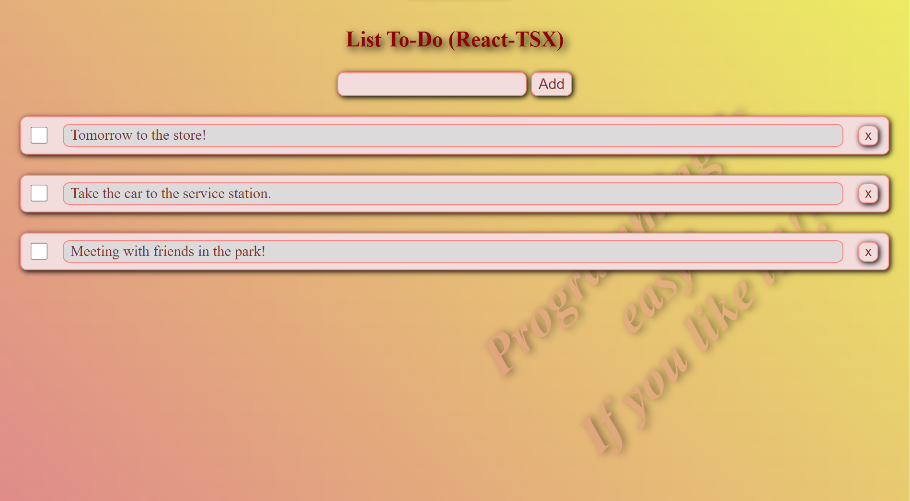
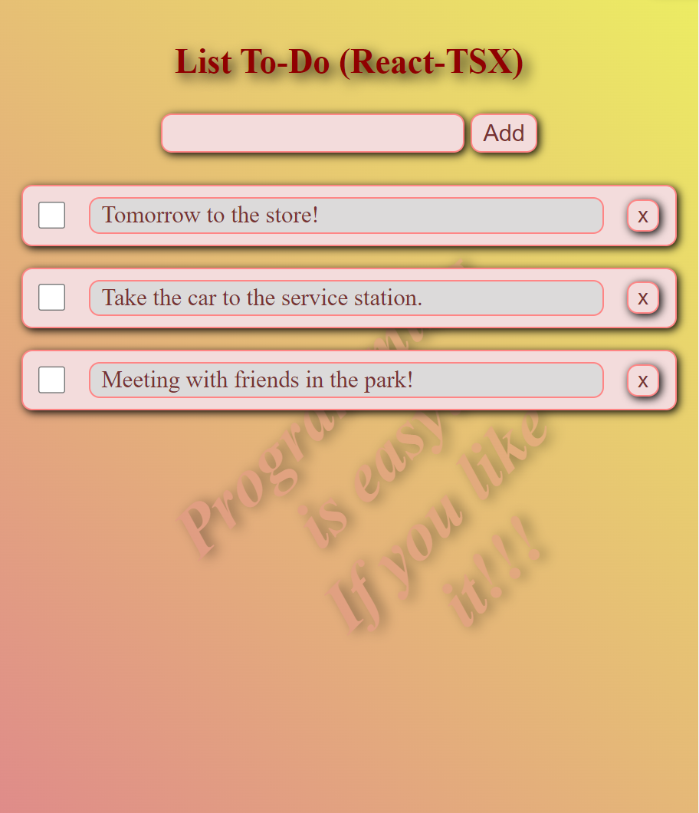
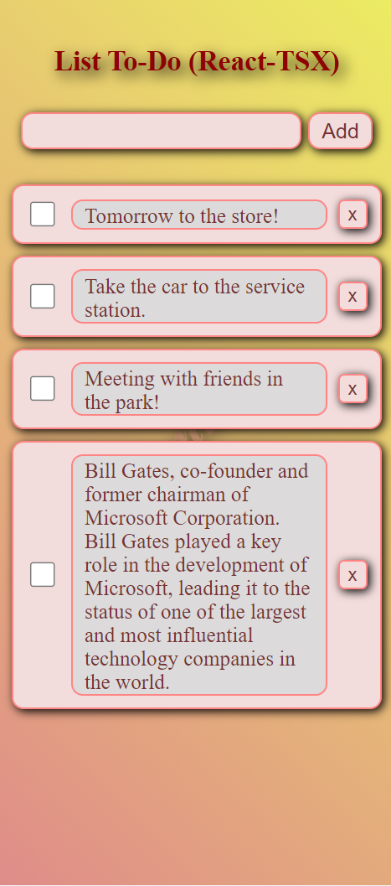

# To-Do List
>Hello, my name is **Sergey**!
 This is the usual ToDo List with the ability to add and delete tasks!.
Tasks are saved in local storage.

### Tech stack
* [X] **React**: *JavaScript-library* for building user interfaces.
* [X] **Vite**: Fast and advanced web application development tool.
* [X] **TSX**: This project is developed using *TypeScript* to facilitate development and ensure high code quality..

___
[Link to the site with the *ToDo List*]()

___
### Screenshot

    
     
    

